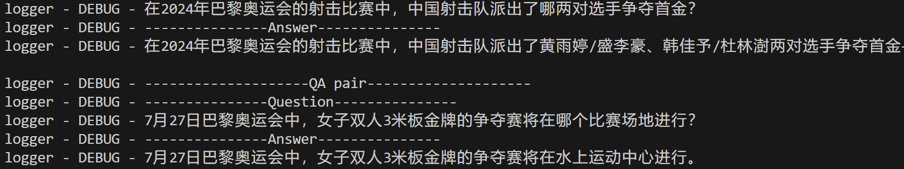
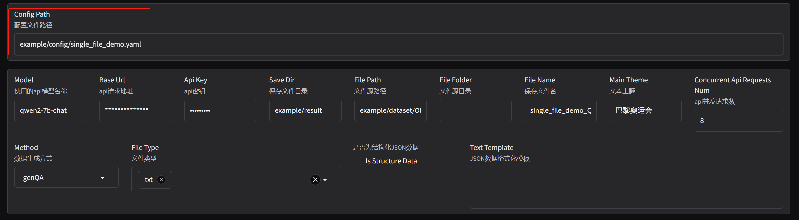
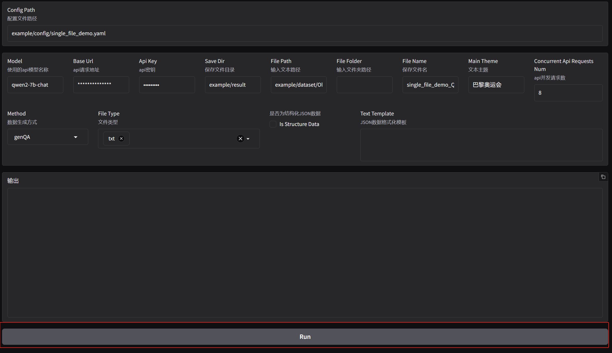
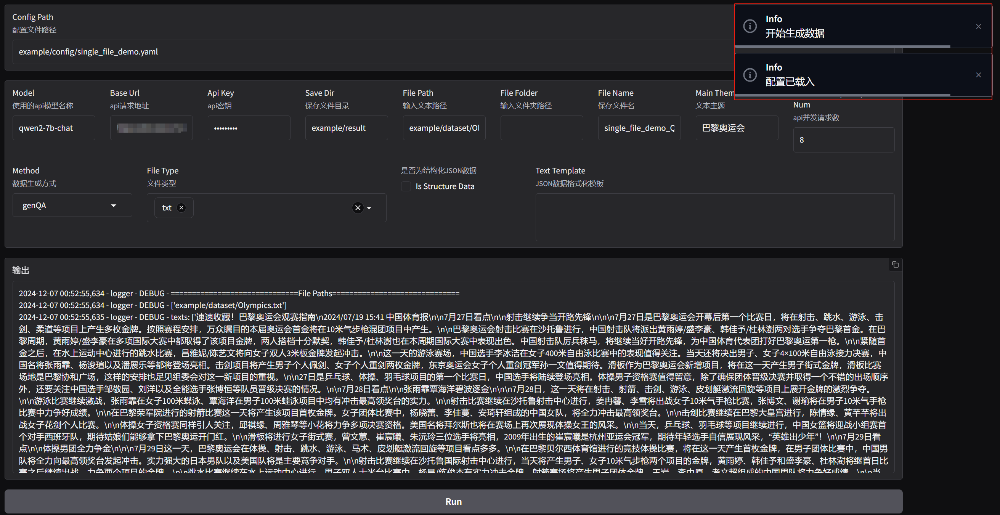

# LlamaFeeder

LlamaFeeder 是一个微调数据集生成工具，可以从文本内容中自动生成质量稳定，多样性高的微调数据集。支持单文件、多文件以及 JSON 格式文件处理以及命令行，WebUI两种使用方式。LlamaFeeder 通过调用 api 来分析文本并生成多样化的问答对，支持多种数据生成策略。此外，用户也可以通过修改、扩展、自定义数据生成策略以适应不同类型的文本特点，提高生成质量。

## 功能特点

- 支持多种数据源输入：单文件、多文件、JSON 文件。
- 提供 WebUI 和命令行两种使用方式。
- 支持异步 API 请求，提高数据生成效率。
- 支持开源大模型与闭源大模型接入。开源模型推荐使用 [imitater](https://github.com/the-seeds/imitater) 接入。闭源模型推荐使用 [One API](https://github.com/songquanpeng/one-api) 接入。

- 多种数据生成策略：
  - 基础问答生成 (genQA)：从文本中提取标题并生成相关问答对。
  - 角色化问答生成 (genQA_persona)：基于不同角色视角生成多样化问答。
  - 回译重写生成 (backtranslation_rewrite)：通过回译和重写提升问答质量。
  - 支持自定义、修改、扩展数据生成策略。

## 使用准备

### 安装

```bash
git clone https://github.com/the-seeds/LlamaFeeder.git
cd LlamaFeeder
pip install -r requirements.txt
```

## 使用方式

工具支持通过 [命令行](#命令行) 或 [WebUI](#WebUI) 方式使用。支持从[单文件](#单文件处理)、 [多文件](#多文件处理) 以及[JSON 文件](#JSON文件处理) 生成问答数据集。

### 命令行

#### 单文件处理

如果您希望使用单个文件（如一篇新闻报道）生成问答数据集，您需要在配置文件中指定输入文本的路径 `file_path`，文本主题 `main_theme` 等设置。 `example/result/single_file_demo_QA.json` 提供了一个示例输出，您可以先查看以了解生成效果。

**示例配置文件：**

```yaml
openai:
  model: ""      # 所使用模型的名称
  base_url: ""   # API URL
  api_key: ""    # API 密钥
  
file_path: "" # 输入文本的路径
main_theme: "" # 文本主题
save_dir: ""     # 生成数据集的保存目录
save_file_name: "" # 生成问答数据集的文件名
concurrent_api_requests_num: 1 # api异步请求数
method: "" # 数据生成方式
```

对于参数的完整说明请参考：[参数说明](#参数说明)

##### 运行

您可以通过在以下示例文件 `example/config/single_file_demo.yaml` 中填入 API 相关配置并且运行指令：

`python main.py example/config/single_file_demo.yaml ` 以尝试使用单个文件生成问答数据集，并在对应保存文件`example/result/single_file_demo_QA.json`中查看生成效果。

```yaml
### example/config/single_file_demo.yaml
openai:
  model: ""
  base_url: ""
  api_key: ""

file_path: "example/dataset/Olympics.txt"
main_theme: "巴黎奥运会"
save_dir: "example/result"
save_file_name: "single_file_demo_QA.json"
method: "genQA"
concurrent_api_requests_num: 1
```

##### 查看运行结果

运行后，应能在终端或者日志目录 `logger/` 中观察到日志文件记录的运行过程，包括本次运行所处理的文件路径，生成的问答对，生成的问答对数目等。




##### 查看生成结果

工具所生成的问答会以 `alpaca `格式分批写入配置文件中的数据保存路径。


此时应该能够在 `example/result` 目录下找到所生成的问答数据集 `single_file_demo_QA.json` 。


除单文件处理外，该工具还支持 [多文件处理](#多文件处理) 与 [JSON 文件处理](#JSON文件处理)


------

#### 多文件处理

如果您需要从多个文件中生成问答数据集（例如处理一批文档、小说等），您需要在配置文件中指定输入文件夹的路径 `file_folder` 以及您希望处理的文件类型 `file_type` 。`example/result/multi_file_demo_QA.json` 提供了一个示例输出，您可以先查看以了解生成效果。

**示例配置文件：**

```yaml
openai:
  model: ""      # 所使用模型的名称
  base_url: ""   # API URL
  api_key: ""    # API 密钥
  
file_folder: "" # 输入文件夹的路径
file_type: "" # 输入文件夹中要处理的文件类型
main_theme: "" # 文本主题
save_dir: ""     # 生成数据集的保存目录
save_file_name: "" # 生成问答数据集的文件名
concurrent_api_requests_num: 1 # api异步请求数
method: "" # 数据生成方式
```

对于参数的完整说明请参考：[参数说明](#参数说明)

您可以通过在示例文件 `example/config/multi_file_demo.yaml` 中填入 API 相关配置并且运行指令：

`python main.py example/config/multi_file_demo.yaml ` 以尝试使用多个文件生成问答数据集。

```yaml
### example/config/multi_file_demo.yaml
openai:
  model: ""
  base_url: ""
  api_key: ""

file_folder: "example/dataset/LLaMA-Factory-Doc" # 输入文件夹路径
file_type: "rst" # 意味着 example/dataset/LLaMA-Factory-Doc 文件夹下所有的 rst 格式的文件都会被用于生成问答数据集
main_theme: "LLaMA-Factory使用文档"
save_dir: "example/result"
save_file_name: "multi_file_demo_QA.json"
method: "genQA"
concurrent_api_requests_num: 1
```


----

#### JSON文件处理

默认情况下，工具会将所有输入文件视为纯文本。如果输入文件是 JSON 格式（例如如下所示的数据结构）：

```json
{
  "date": "2024-01-01",
  "title": "会议通知",
  "source": "C先生",
  "content": "今天上午11:00在A楼B会议室召开会议，请准时到达。"
}
```

如果您不希望以纯文本方式读取 JSON 文件，您需要将 `is_structure_data` 设置为 `True`，并定义 `text_template` 模板以便从 JSON 数据中提取信息并以所需格式生成文本。

例如，假设您希望将上述 JSON 数据转化为以下格式作为模型的输入：

```
【标题】: 会议通知
【来源】: C先生
【时间】: 2024-01-01
【内容】: 今天上午11:00在A楼B会议室召开会议，请准时到达。
```

您需要在配置文件中将 `is_structure_data` 设置为 `True`，并定义 `text_template`为：` "【标题】: {title}\n【来源】: {source}\n【时间】: {date}\n【内容】: {content}\n" `

**配置文件示例：**

以下是 JSON 文件处理配置文件的完整示例，与其他配置文件类似，您可以通过在示例文件 `example/config/json_file_demo.yaml` 中填入 API 相关配置并且运行指令：

`python main.py example/config/json_file_demo.yaml ` 以尝试使用 JSON 格式文件生成问答数据集。`example/result/json_file_demo_QA.json` 提供了一个示例输出，您可以先查看以了解生成效果。

```yaml
### example/config/json_file_demo.yaml
openai:
  model: ""
  base_url: ""
  api_key: ""

file_path: "example/dataset/dataset.json"
main_theme: "地理科普"
save_dir: "example/result"
save_file_name: "json_file_demo_QA.json"
concurrent_api_requests_num: 1
method: "genQA"
is_structure_data: True  # 表示输入文件是结构化数据
text_template: "【标题】: {title}\n【来源】: {source}\n【时间】: {date}\n【内容】: {content}\n"  # JSON 数据的格式模板
```
对于参数的完整说明请参考：[参数说明](#参数说明)

>[!TIP]
>
>同样，您也可以指定 `file_folder` 和 `file_type` 以使用多个 JSON 格式文件生成问答数据集。


### WebUI

#### 启动

WebUI 通过在 `src` 目录下运行以下命令启动：

```bash
python webui.py
```

若点击所提供 url（通常是:http://127.0.0.1:7860 ）后出现以下界面则说明启动成功。


#### 载入配置文件

若您已配置好配置文件，可直接输入配置文件路径后回车。您应当可以看到各个配置项正常导入。导入配置文件后，您可以根据在 WebUI 根据需求修改配置，例如更改文件保存路径，文件保存名等。



#### 运行

配置完成并确认无误后，点击 `Run` 按钮便可开始生成数据。



若可以看到跳出成功提示，并可观察到输出文本框日志便说明启动成功。




### 参数说明

| 参数名                      | 参数介绍                                                     | 默认值       |
| --------------------------- | ------------------------------------------------------------ | ------------ |
| openai.model                | API 模型名称                                                 | \            |
| openai.base_url             | API URL地址                                                  | \            |
| openai.api_key              | API密钥                                                      | \            |
| save_dir                    | 生成的数据集保存目录                                         | example/     |
| file_path                   | 输入文本路径                                                 | \            |
| file_folder                 | 输入文件夹路径                                               | \            |
| file_type                   | 输入文件夹中要处理的文件类型，多个类型用空格分隔             | txt          |
| main_theme                  | 文本主题                                                     | \            |
| concurrent_api_requests_num | API并发请求数量                                              | 4            |
| method                      | 数据生成方式                                                 | genQA        |
| save_file_name              | 生成问答数据集的文件名                                       | dataset.json |
| is_structure_data           | 是否是结构化 JSON 数据，是则按照text_template读取文本，否则直接读入纯文本 | False        |
| text_template               | 从 JSON 格式数据构造生成问题所需文本的模板。                 | \            |

> 输入纯文本时请设置 is_structure_data 为 False。
>
> 设置 is_structure_data 为 True 时请确保 JSON 格式数据包含 text_template 中对应的键。
>
> 设置 file_folder 会将 file_path 覆盖。

