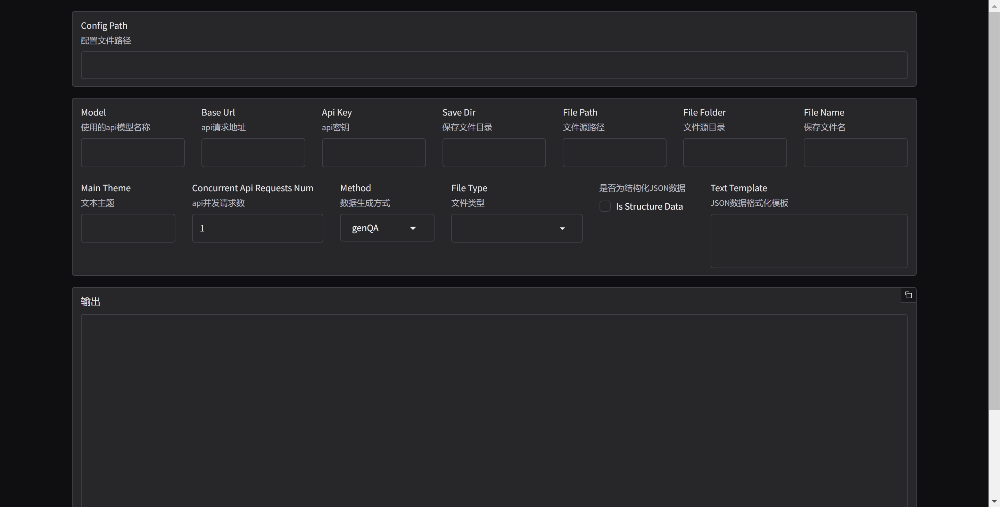
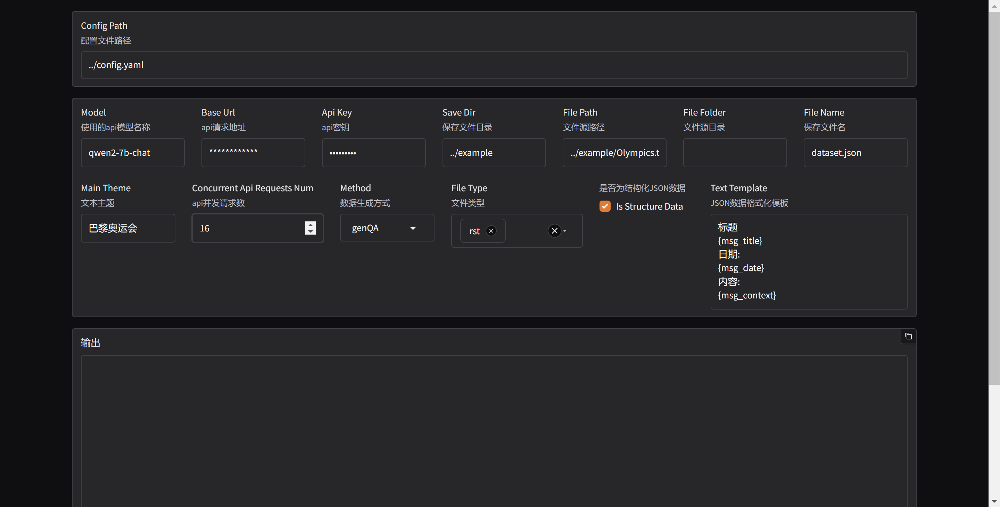

# LlamaFeeder

## 使用步骤

### 安装

```bash
git clone https://github.com/the-seeds/LlamaFeeder.git
cd LlamaFeeder
pip install -r requirements.txt
```

### 配置文件

配置文件示例：

```yaml
openai:
  model: ""      # 所使用模型的名称
  base_url: ""   # API URL
  api_key: ""    # API 密钥
  
file_path: "" # 输入文本的路径
main_theme: "" # 文本主题
save_dir: ""     # 生成数据集的保存目录
save_file_name: "" # 生成问答数据集的文件名
concurrent_api_requests_num: 1 # api异步请求数
method: "" # 数据生成方式
```

> [!NOTE]
> 闭源模型推荐使用 [One API](https://github.com/songquanpeng/one-api) 接入。
> 
> 开源模型推荐使用 [imitater](https://github.com/the-seeds/imitater) 接入。


### 参数说明

| 参数名                      | 参数介绍                                                     | 默认值       |
| --------------------------- | ------------------------------------------------------------ | ------------ |
| openai.model                | API 模型名称                                                 | \            |
| openai.base_url             | API URL地址                                                  | \            |
| openai.api_key              | API密钥                                                      | \            |
| save_dir                    | 生成的数据集保存目录                                         | example/     |
| file_path                   | 输入文本路径                                                 | \            |
| file_folder                 | 输入文件夹路径                                               | \            |
| file_type                   | 输入文件夹中要处理的文件类型，多个类型用空格分隔             | txt          |
| main_theme                  | 文本主题                                                     | \            |
| concurrent_api_requests_num | API并发请求数量                                              | 4            |
| method                      | 数据生成方式                                                 | genQA        |
| save_file_name              | 生成问答数据集的文件名                                       | dataset.json |
| is_structure_data           | 是否是结构化 JSON 数据，是则按照text_template读取文本，否则直接读入纯文本 | False        |
| text_template               | 从 JSON 格式数据构造生成问题所需文本的模板。                 | \            |

> 输入纯文本时请设置 is_structure_data 为 False。
>
> 设置 is_structure_data 为 True 时请确保 JSON 格式数据包含 text_template 中对应的键。
>
> 设置 file_folder 会将 file_path 覆盖。


### 数据格式

工具所生成的问答数据集默认以 `alpaca` 格式保存，如：

```json
{
    "instruction": "中国的首都是哪里？",
    "input": "",
    "output": "中国的首都是北京。"
}
```

### 使用方式

#### 命令行

##### 单文件处理

如果您希望使用单个文件（如一篇新闻报道）生成问答数据集，您需要指定输入文本的路径 `file_path`，文本主题 `main_theme` 等设置。

**示例配置文件：**

```yaml
openai:
  model: ""      # 所使用模型的名称
  base_url: ""   # API URL
  api_key: ""    # API 密钥
  
file_path: "" # 输入文本的路径
main_theme: "" # 文本主题
save_dir: ""     # 生成数据集的保存目录
save_file_name: "" # 生成问答数据集的文件名
concurrent_api_requests_num: 1 # api异步请求数
method: "" # 数据生成方式
```

您可以通过在示例文件 `example/config/single_file_demo.yaml` 中填入 API 相关配置并且运行指令：

`python main.py example/config/single_file_demo.yaml ` 以尝试使用单个文件生成问答数据集。

```yaml
### example/config/single_file_demo.yaml
openai:
  model: ""
  base_url: ""
  api_key: ""

file_path: "example/dataset/Olympics.txt"
main_theme: "巴黎奥运会"
save_dir: "example/result"
save_file_name: "Olympics_QA.json"
method: "genQA"
concurrent_api_requests_num: 1
```

------

##### 多文件处理

如果您需要从多个文件中生成问答数据集（例如处理一批文档、小说等），您需要指定输入文件夹的路径 `file_folder` 以及您希望处理的文件类型 `file_type` 。

**示例配置文件：**

```yaml
openai:
  model: ""      # 所使用模型的名称
  base_url: ""   # API URL
  api_key: ""    # API 密钥
  
file_folder: "" # 输入文件夹的路径
file_type: "" # 输入文件夹中要处理的文件类型
main_theme: "" # 文本主题
save_dir: ""     # 生成数据集的保存目录
save_file_name: "" # 生成问答数据集的文件名
concurrent_api_requests_num: 1 # api异步请求数
method: "" # 数据生成方式
```


您可以通过在示例文件 `example/config/multi_file_demo.yaml` 中填入 API 相关配置并且运行指令：

`python main.py example/config/multi_file_demo.yaml ` 以尝试使用多个文件生成问答数据集。

```yaml
### example/config/multi_file_demo.yaml
openai:
  model: ""
  base_url: "" 
  api_key: ""

file_folder: "example/LLaMA-Factory-Doc" # 输入文件夹的路径
file_type: "rst md" # 意味着 example/LLaMA-Factory-Doc 文件夹下所有的 rst 与 md 格式的文件都会被用于生成问答数据集
main_theme: "LLaMA-Factory使用文档"
save_dir: "example/result"
save_file_name: "docs_QA.json"
method: "genQA"
concurrent_api_requests_num: 1
```


----

##### JSON文件处理

默认情况下，工具会将所有输入文件视为纯文本。如果输入文件是 JSON 格式，您需要将 `is_structure_data` 设置为 `True`，并定义 `text_template` 模板，用于从 JSON 数据中提取信息并以所需格式生成文本。

**配置文件示例：**

在配置文件中，您需要设置 `is_structure_data: True` 来指定输入文件为 JSON 数据，并提供 `text_template`，以便从 JSON 格式的数据中提取所需的字段以组成输入文本。

您可以通过在示例文件 `example/config/json_file_demo.yaml` 中填入 API 相关配置并且运行指令：

`python main.py example/config/json_file_demo.yaml ` 以尝试使用 JSON 格式文件生成问答数据集。

```yaml
### example/config/json_file_demo.yaml
openai:
  model: ""      
  base_url: ""   
  api_key: ""

file_path: "/example/dataset/dataset.json"
main_theme: "地理科普"
save_dir: "../example/result"
save_file_name: "jsonfile_demo_QA.json"
concurrent_api_requests_num: 1
method: "genQA"
is_structure_data: True  # 表示输入文件是结构化数据
text_template: "【标题】: {title}\n【来源】: {source}\n【时间】: {date}\n【内容】: {content}\n"  # JSON 数据的格式模板
```

>[!TIP]
>
>同样，您也可以指定 `file_folder` 和 `file_type` 以使用多个 JSON 格式文件生成问答数据集。


**JSON 文件数据示例**

假设输入的 JSON 文件内容如下：

```json
{
  "date": "2024-01-01",
  "title": "会议通知",
  "source": "C先生",
  "content": "今天上午11:00在A楼B会议室召开会议，请准时到达。"
}
```

根据上述 `text_template` 模板，工具会将 JSON 格式数据解析并转换为以下文本：

```
【标题】: 会议通知
【来源】: C先生
【时间】: 2024-01-01
【内容】: 今天上午11:00在A楼B会议室召开会议，请准时到达。
```


#### WebUI

##### 启动

WebUI 通过在 `src` 目录下运行以下命令启动：

```bash
python webui.py
```

若点击所提供 url（通常是:http://127.0.0.1:7860 ）后出现以下界面则说明启动成功。



##### 使用

若您已配置好配置文件，可直接输入配置文件路径载入并进行修改。此外您也可以直接在 WebUI 界面直接进行文件配置。



配置完成后，点击 `Run` 按钮便可开始生成数据。
